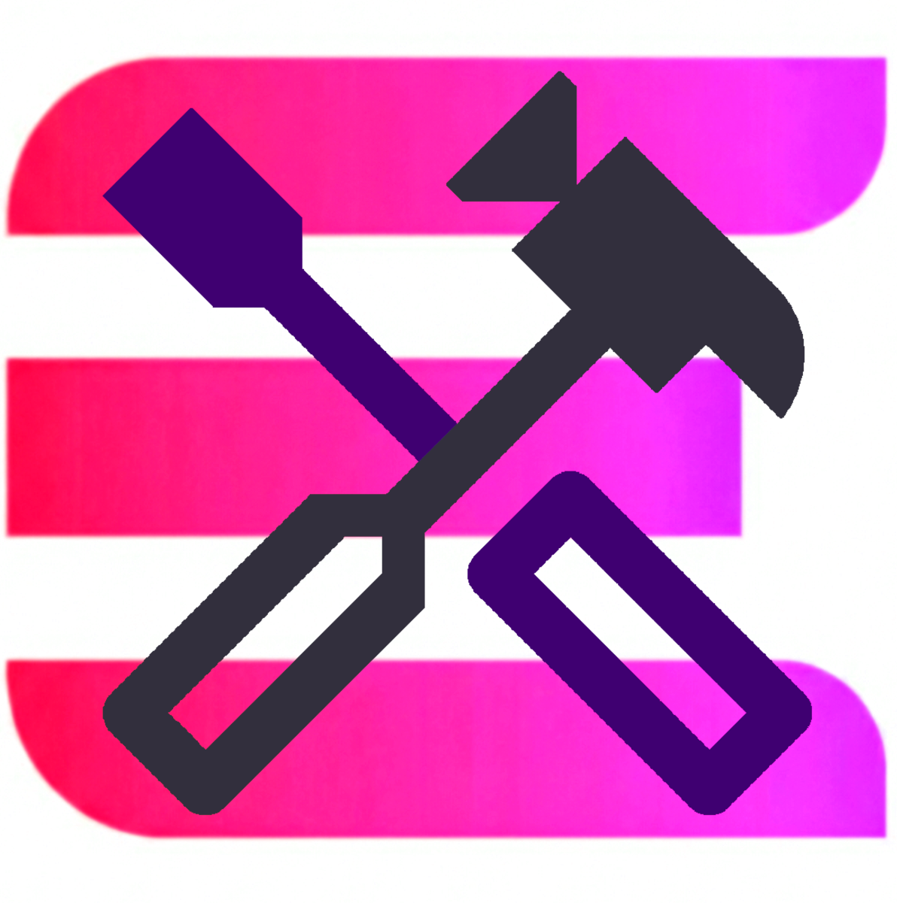

# ElectroMods



**A Community-Driven Song Manager for Electronauts VR**

### First Time Setup

1. **Launch ElectroMods** - Run the application
2. **Select Game Path** - You'll be prompted to select your Electronauts installation folder
3. **Install Modding Support** - Click "Yes" when asked to install modding support
4. **Initialize** - Launch Electronauts once to initialize the mod framework and to copy default mod songs to your Documents folder
5. **Download Songs** - Navigate to the "Songs" tab and start downloading songs :)

- Automatically detects Electronauts installation path
- One-click modding support installation
- Automatic plugin setup
- Songs installed to `Documents\Electronauts\Mods`

To create your own custom songs, please check out the guide on the Steam Community page: [Creating Custom Songs](https://steamcommunity.com/sharedfiles/filedetails/?id=2691858233). If you need help, see the Support section below.

## Roadmap
- [ ] Modding support for additional BepInEx plugins and patches (like custom drumsticks, instruments, maps etc.)
- [ ] User reviews and ratings for songs and mods
- [ ] Ability to modify your custom song details and upload/update directly in-app

## Troubleshooting

### "Modding installation failed"
- Ensure Electronauts is not running
- Run ElectroMods as Administrator
- Verify you have write permissions to the Electronauts folder

### "Song not appearing in game"
- Launch Electronauts once after installing modding support
- Verify the song downloaded successfully (check `Documents\Electronauts\Mods`)
- Restart Electronauts if it's running

### "Failed to mod Electronauts"
- Ensure you selected the correct Electronauts installation folder
- Run ElectroMods as Administrator
- Verify game files through Steam

### "Upload failed"
- Verify you're logged in with Discord
- Check your ZIP file format
- Ensure Config.txt has all required fields

### Building ElectroMods

To build ElectroMods yourself, follow these steps:

1. **Clone the repository**
   ```bash
   git clone https://github.com/YourUsername/ElectroMods.git
   ```

2. **Configure Discord Client Secret**
   
   You'll need to set up your own Discord OAuth application:
   
   a. Go to [Discord Developer Portal](https://discord.com/developers/applications)
   
   b. Create a new application
   
   c. Add OAuth2 redirect URL: `http://localhost:3000/callback`
   
   d. Copy your Client Secret
   
   e. Edit `Settings.settings` and replace the `DiscordClientSecret` value.

	Note: The backend only uses the signed in user's Discord ID to verify if they uploaded the song. you CAN use the application without setting up your own Discord app, but due to this you won't be able to upload songs or manage ones you've already uploaded.

3. **Build the solution**
   ```bash
   dotnet build --configuration Release
   ```

4. **Run the application**
   ```bash
   dotnet run --project ElectroMods.csproj
   ```

## Support
If you encounter any issues or have questions, please open an issue on the [GitHub Issues]() page or join our [Discord Server](https://discord.gg/y76xhCSnBM). 

We're much more active on the Discord, and there's a good chance someone else has had the same question as you :)

## Acknowledgments

- **BepInEx:** This application bundles [BepInEx](https://github.com/BepInEx/BepInEx) v5.4.22, a Unity modding framework licensed under LGPL-2.1. See `BepInEx/LICENSE` for details.
- **Game Developer:** Survios
- **Community:** All the song creators
- **Libraries:**
  - [Microsoft-WindowsAPICodePack-Shell](https://www.nuget.org/packages/Microsoft-WindowsAPICodePack-Shell/)
  - .NET 10 Framework

## License

This project is licensed under the MIT License - see the [LICENSE](LICENSE) file for details.
